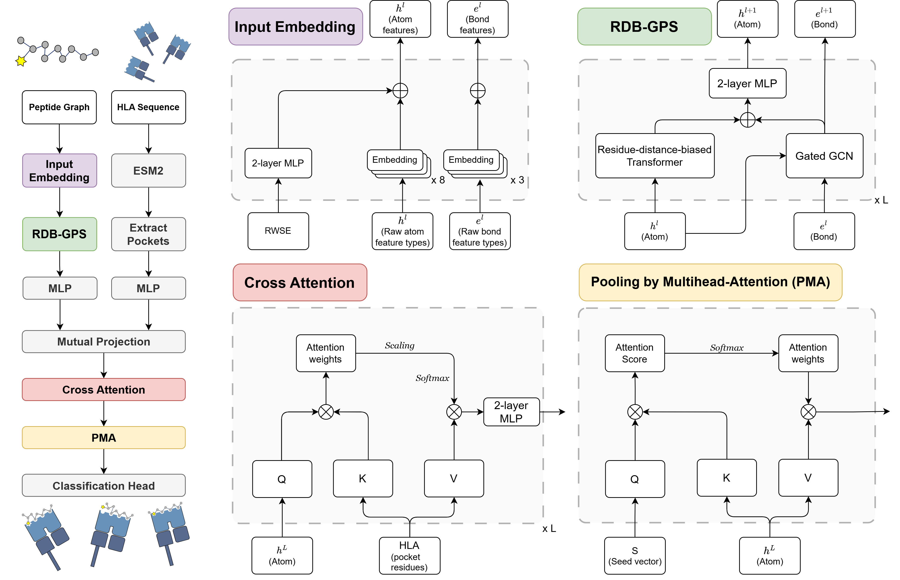

# PAPHLA: PTM-aware prediction of peptide-HLA class I binding



### Introduction
PAPHLA is a pan-specific model for predicting peptide-HLA class I binding in the presence of PTM.

### Installation
We have tested our code on `Python 3.11` with `PyTorch 2.5.1`, `PyG 2.6.1` and `CUDA 12.1`. Please follow the following steps to create a virtual environment and install required packages.

```bash
conda create -n paphla python=3.11
conda activate paphla

# PyTorch + CUDA (conda)
conda install pytorch==2.5.1 torchvision==0.20.1 torchaudio==2.5.1 pytorch-cuda=12.1 -c pytorch -c nvidia

# PyG (pip wheels matched to torch 2.5.1 + cu121)
pip install pyg-lib torch-scatter torch-sparse torch-cluster torch-spline-conv -f https://data.pyg.org/whl/torch-2.5.1+cu121.html
pip install torch-geometric==2.6.1

# RDKit / chemistry deps (conda-forge)
conda install -y rdkit -c conda-forge

# Others
pip install tqdm scikit-learn torchmetrics

conda clean --all -y
```

### Data processing
All the datasets used in the paper can be obtained from `data/` directory.

Details of data curation and preprocessing can be found in `notebooks/` directory.

We use specifically use `memory-mapped dataset` to allow fast training of large graph datasets in this implementation, but you may use `InMemoryDataset` from `PyG` for much smaller datasets.

To process the data, run:
```bash
python datasets.py --data/train/train.csv
```

After running the code, it will produce `data/processed/train` directory:
- node_boundaries.npy
- node_features.npy
- res_indices.npy
- rwse_features.npy
- edge_attrs.npy
- edge_boundaries.npy
- edge_indices.npy

### Training
To train the model, run:
```bash
python train.py --config/pretrain.yaml
python train.py --config/finetune.yaml
```

You may edit yaml file for different configurations. The trained model parameters will be saved under `models/` directory.

### Inference
To test the model, run:
```bash
python predict.py --config/test.yaml
```

You may edit yaml file for different model parameters. The predictions will be saved as a `.csv` file under `results/` directory.


### Acknowledgement
Parts of the model implementation were adapted from [GraphGPS](https://github.com/rampasek/GraphGPS) which is built using [PyG](https://www.pyg.org/) and [GraphGym from PyG2](https://pytorch-geometric.readthedocs.io/en/2.0.0/notes/graphgym.html).

We thank the original authors for making their code publicly available.

# PAPHLA